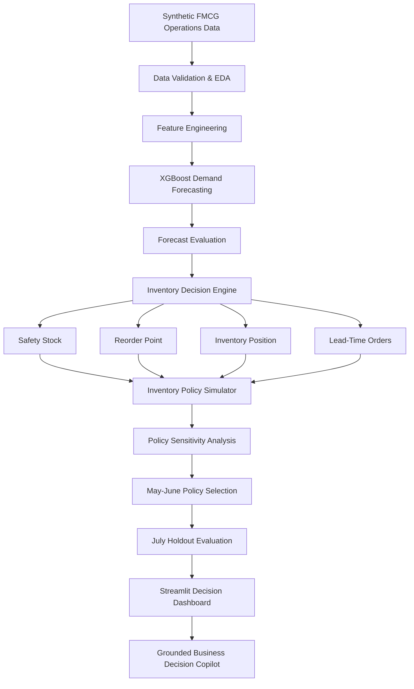
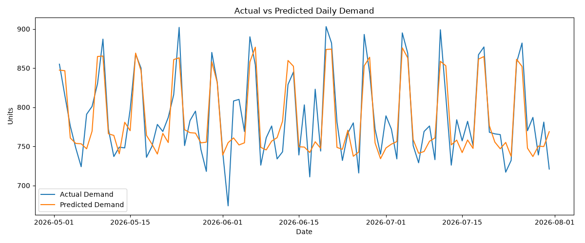
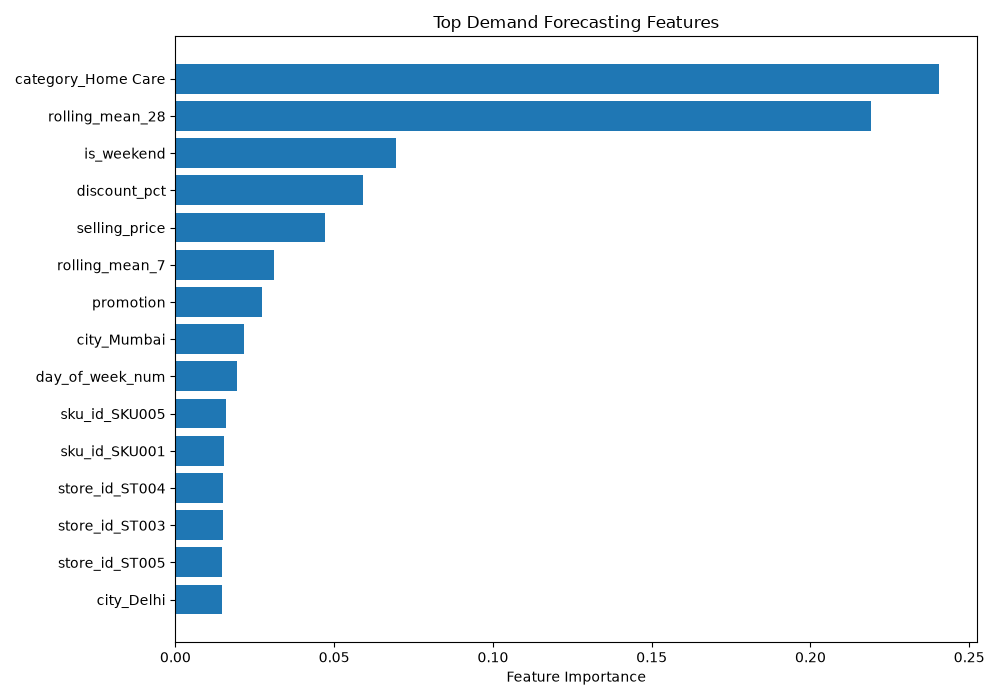
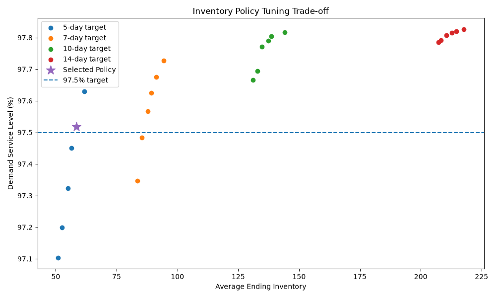

# FMCG Decision Intelligence Platform

[](https://fmcg-decision-intelligence.streamlit.app/)

An end-to-end machine learning and decision intelligence platform for **FMCG demand forecasting, inventory optimisation and operational decision support**.

The project combines time-series feature engineering, XGBoost demand forecasting, lead-time-aware inventory simulation, policy optimisation, interactive analytics and a grounded business decision copilot.

> **Note:** This project uses a synthetic FMCG dataset designed to simulate realistic store-SKU demand, promotions, pricing, replenishment and stockout behaviour. All reported business improvements are simulation results, not claims from a real company deployment.

---

## Project Highlights

- Generated **23,575 store-SKU-day transactions** across 5 cities and 5 FMCG products
- Built an XGBoost demand forecasting model using lag, rolling-demand, calendar, pricing and promotion features
- Achieved **15.81% MAPE**
- Improved MAE by **32.4%** versus a lag-7 forecasting baseline
- Designed a lead-time-aware replenishment system using:
  - demand forecasts
  - safety stock
  - reorder points
  - inventory position
  - outstanding supplier orders
- Evaluated **24 inventory policies** using service-level and inventory trade-offs
- Tuned inventory parameters on May–June and evaluated the locked policy on an **untouched July holdout**
- Built an interactive Streamlit dashboard and grounded Decision Copilot
- Added **24 automated tests** covering data integrity, forecasting and inventory-policy behaviour

---

# Business Impact

## July 2026 Holdout Evaluation

Inventory-policy parameters were selected using May–June data and then locked before evaluation on July.

| Metric | Rule-Based Baseline | Forecast-Driven Policy | Impact |
|---|---:|---:|---:|
| Demand Service Level | 93.54% | **99.81%** | +6.27 pp |
| Lost Sales | 1,574 | **46** | **97.08% reduction** |
| Stockout Events | 94 | **10** | **89.36% reduction** |
| Average Ending Inventory | 85.26 | **59.85** | **29.81% reduction** |
| Revenue | ₹37.74 L | **₹40.22 L** | **6.57% improvement** |

**Additional simulated revenue captured:** approximately **₹2.48 lakh during the July holdout period**.

These results reflect the complete forecast-driven replenishment policy rather than the forecasting model alone.

---

# System Architecture



---

# Demand Forecasting

The forecasting target is **customer demand**, not observed units sold.

This distinction is important because observed sales may be artificially constrained by inventory availability.

For example:

```text
Customer demand = 40 units
Available inventory = 25 units
Observed sales = 25 units
Lost sales = 15 units
```

Training directly on units sold would incorrectly teach the model that demand was only 25 units.

## Forecast Features

The model uses:

- Store and city
- SKU and product category
- Base price
- Selling price
- Promotion flag
- Discount percentage
- Weekend indicator
- Month
- Quarter
- Week of year
- Day of week
- Lag-1 demand
- Lag-7 demand
- Lag-14 demand
- Lag-28 demand
- 7-day rolling demand
- 28-day rolling demand
- Recent demand volatility

Rolling features are shifted before calculation to prevent leakage from the prediction date.

---

# Model Validation

A chronological train-test split is used instead of a random split.

The final 90 days are reserved for forecasting evaluation.

### Forecast Performance

| Metric | Result |
|---|---:|
| MAE | **4.53 units** |
| RMSE | **5.73 units** |
| MAPE | **15.81%** |
| MAE improvement vs lag-7 baseline | **32.4%** |

The forecasting system is designed as an operational rolling one-step-ahead forecasting workflow.

---

# Inventory Optimisation

The inventory engine converts demand forecasts into operational replenishment decisions.

## Safety Stock

Safety stock is estimated using recent demand variability:

```text
Safety Stock
=
Service Factor
× Demand Standard Deviation
× √Lead Time
```

---

## Reorder Point

```text
Reorder Point
=
Expected Lead-Time Demand
+
Safety Stock
```

---

## Inventory Position

The system accounts for both physical stock and outstanding supplier orders:

```text
Inventory Position
=
Ending Inventory
+
Quantity Already On Order
```

This prevents unnecessary duplicate replenishment orders.

---

## Replenishment Simulation

Supplier orders are not assumed to arrive instantly.

The simulation explicitly models a **3-day supplier lead time**.

Each day:

1. previously placed orders that have reached their delivery date are received
2. customer demand occurs
3. actual sales are constrained by available inventory
4. lost sales are calculated
5. the forecast-driven policy evaluates inventory position
6. a replenishment order may be placed
7. the order arrives after the configured lead time

---

# Inventory Policy Optimisation

Instead of choosing arbitrary replenishment parameters, the project evaluates **24 policy combinations** across:

- multiple safety-stock service factors
- multiple order-up-to inventory coverage targets

Policies are evaluated on:

- demand service level
- lost sales
- stockout events
- average inventory
- revenue
- total order quantities

The selected policy is the lowest-inventory policy satisfying a predefined service-level constraint during the tuning period.

To avoid selecting and evaluating the inventory policy on the same data:

```text
May–June 2026
        ↓
Inventory Policy Tuning
        ↓
Select Policy
        ↓
Lock Parameters
        ↓
July 2026
        ↓
Untouched Holdout Evaluation
```

---

# Interactive Decision Intelligence Dashboard

The Streamlit application contains five modules.

## 1. Executive Overview

Provides:

- historical revenue
- demand fulfilment
- forecast accuracy
- inventory-policy business impact
- revenue trends
- city-level performance
- category sales mix

## 2. Demand Forecasting

Allows interactive exploration of:

- actual vs predicted demand
- city-level forecasts
- product-level forecasts
- error distributions
- forecast metrics

## 3. Inventory Optimisation

Compares:

- rule-based baseline
- forecast-driven policy
- service levels
- lost sales
- stockout events
- inventory levels
- simulated revenue
- policy trade-offs

## 4. SKU Decision Centre

Provides operational store-SKU decisions including:

- predicted daily demand
- on-hand inventory
- inventory already on order
- physical inventory cover
- effective inventory cover
- recommended replenishment quantity
- post-order cover
- operational status

Statuses include:

```text
STOCKOUT
REORDER DUE
IN TRANSIT
HEALTHY
```

## 5. Grounded Decision Copilot

A zero-cost natural-language analytics interface that answers supported business questions using calculated project data.

Example questions:

```text
Which SKUs need immediate management attention?

What replenishment actions should I prioritise today?

How much revenue did the optimized policy recover?

Compare Chennai and Mumbai.

Tell me about Bath Soap 100g.

How accurate is the demand forecast?
```

The copilot is deterministic and grounded in project datasets rather than generating unsupported business figures.

---

# Example Visualisations

## Actual vs Predicted Demand



## Demand Forecast Feature Importance



## Inventory Policy Trade-Off



---

# Automated Testing

The project includes automated tests for:

### Data Integrity

- unique store-SKU-date records
- non-negative inventory and sales values
- lost-sales accounting
- stockout-flag consistency
- pricing constraints
- revenue calculations

### Forecasting

- prediction output completeness
- non-negative forecasts
- prediction error calculations
- XGBoost performance versus lag-7 baseline
- forecast MAPE guardrail

### Inventory Optimisation

- policy output validation
- non-negative inventory
- demand balance
- improved holdout service level
- lower lost sales
- fewer stockout events
- lower average inventory
- higher simulated revenue

Run:

```bash
python -m pytest -q
```

Current project status:

```text
24 passed
```

A complete project health check is also available:

```bash
python scripts/health_check.py
```

---

# Project Structure

```text
fmcg-decision-intelligence/
│
├── dashboard/
│   └── app.py
│
├── data/
│   └── processed/
│       ├── fmcg_sales.csv
│       ├── demand_predictions.csv
│       ├── inventory_policy_tuning.csv
│       ├── inventory_holdout_results.csv
│       └── best_inventory_policy_simulation.csv
│
├── models/
│   ├── demand_forecast_xgb.pkl
│   └── model_features.pkl
│
├── reports/
│   └── figures/
│
├── scripts/
│   └── health_check.py
│
├── src/
│   ├── analysis/
│   │   └── eda.py
│   │
│   ├── data/
│   │   └── generate_data.py
│   │
│   ├── inventory/
│   │   ├── recommend_inventory.py
│   │   ├── simulate_optimized_policy.py
│   │   └── tune_inventory_policy.py
│   │
│   └── models/
│       └── train_model.py
│
├── tests/
│   ├── test_data_integrity.py
│   ├── test_forecasting.py
│   └── test_inventory_policy.py
│
├── .gitignore
├── requirements.txt
└── README.md
```

---

# Running the Project

## 1. Clone the repository

```bash
git clone https://github.com/CodeWithSharda/fmcg-decision-intelligence.git
cd fmcg-decision-intelligence
```

## 2. Create a virtual environment

```bash
python -m venv .venv
```

Activate it on Windows:

```bash
.venv\Scripts\activate
```

## 3. Install dependencies

```bash
pip install -r requirements.txt
```

## 4. Run automated tests

```bash
python -m pytest -q
```

## 5. Run the health check

```bash
python scripts/health_check.py
```

## 6. Launch the dashboard

```bash
streamlit run dashboard/app.py
```

---

# Technology Stack

**Programming**
- Python

**Data & Analytics**
- Pandas
- NumPy

**Machine Learning**
- XGBoost
- Scikit-learn
- Joblib

**Visualisation**
- Plotly
- Matplotlib

**Application**
- Streamlit

**Testing**
- Pytest

**Engineering**
- Git
- GitHub
- Virtual environments
- Automated health checks

---

# Design Decisions

Several choices were deliberately made to improve technical validity:

### Time-based model validation

Forecasting data is split chronologically rather than randomly.

### Leakage prevention

Lag and rolling-demand features only use information available before the prediction date.

### Customer demand rather than sales as target

This prevents stockouts from causing artificially low demand labels.

### Explicit supplier lead time

Replenishment orders arrive after a delay instead of instantly.

### Inventory-position modelling

Outstanding supplier orders are incorporated before placing new orders.

### Separate policy tuning and evaluation periods

Inventory parameters are chosen using May–June and evaluated on July.

### Grounded decision interface

The Decision Copilot calculates answers directly from project data instead of fabricating unsupported business values.

---

# Limitations

This project is intended as a technical decision-intelligence demonstration rather than a production FMCG forecasting system.

Current limitations include:

- synthetic rather than enterprise transaction data
- limited number of products and stores
- fixed supplier lead-time assumption
- no supplier capacity constraints
- no explicit inventory holding-cost model
- no expiry or shelf-life modelling
- no product substitution effects
- point forecasts rather than probabilistic demand forecasts
- promotional effects are simulated rather than estimated from real campaigns

These limitations are intentionally documented to avoid overstating the results.

---

# Potential Extensions

Future versions could incorporate:

- probabilistic demand forecasting
- weather and holiday signals
- real promotional calendars
- supplier reliability modelling
- inventory holding and shortage costs
- multi-echelon inventory optimisation
- product substitution
- expiry-aware replenishment
- automated model monitoring
- drift detection
- REST API deployment
- containerisation
- enterprise LLM integration for broader natural-language analytics

---

# Disclaimer

All companies, products, transactions and business outcomes represented in this project are simulated for educational and portfolio purposes.

Reported revenue, demand, inventory and optimisation improvements are **simulation results** and should not be interpreted as results achieved for any real organisation.